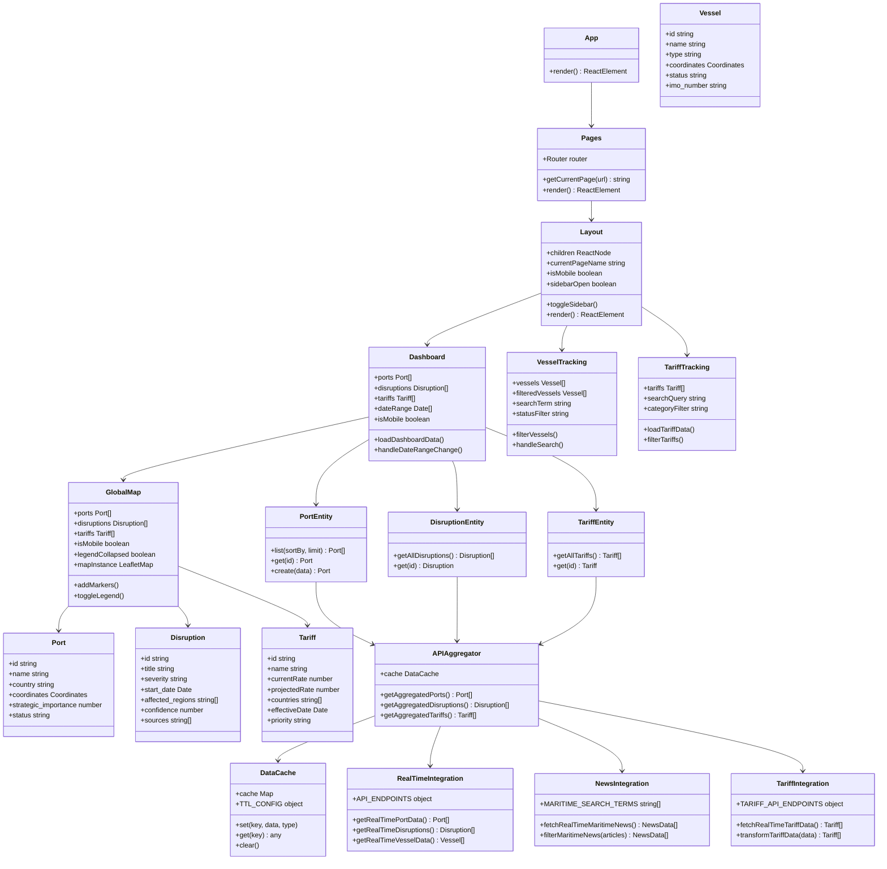

# TradeWatch - Complete System Architecture

**VectorStream Systems - Global Trade Intelligence Platform**

*Version 3.0 - August 2024*

---

## Executive Summary

TradeWatch is a comprehensive maritime trade intelligence platform designed to monitor global trade disruptions, vessel movements, tariff impacts, and supply chain analytics in real-time. Built with modern React architecture, the system provides both web and mobile experiences for enterprise maritime intelligence operations.

## System Overview UML Diagram



---

# TradeWatch Application - UML Architecture Documentation

## 🏗️ System Architecture Overview

TradeWatch is a comprehensive maritime trade intelligence platform built with React, featuring real-time data integration, interactive mapping, and mobile-responsive design.

## 📊 UML Class Diagram Structure

### 1. Application Layer (Presentation)

#### Main Application Components
```typescript
class App {
  +render(): ReactElement
}

class Pages {
  +Router: router
  +PAGES: object
  +getCurrentPage(url: string): string
  +PagesContent(): ReactElement
  +render(): ReactElement
}

class Layout {
  +children: ReactNode
  +currentPageName: string
  +isMobile: boolean
  +isTablet: boolean
  +sidebarOpen: boolean
  +navigationItems: NavigationItem[]
  +toggleSidebar(): void
  +checkDevice(): void
  +render(): ReactElement
}
```

#### Page Components
```typescript
class Dashboard {
  +ports: Port[]
  +disruptions: Disruption[]
  +tariffs: Tariff[]
  +selectedPort: Port
  +isLoading: boolean
  +mapCenter: Coordinates
  +mapZoom: number
  +dateConfig: DateConfig
  +selectedDateRange: Date[]
  +isMobile: boolean
  +loadDashboardData(): Promise<void>
  +handlePortClick(port: Port): void
  +handleDateRangeChange(range: Date[]): void
  +filteredDisruptions: Disruption[]
  +getCriticalDisruptions: Disruption[]
  +render(): ReactElement
}

class VesselTracking {
  +vessels: Vessel[]
  +filteredVessels: Vessel[]
  +isLoading: boolean
  +searchTerm: string
  +statusFilter: string
  +typeFilter: string
  +impactFilter: string
  +selectedVessel: Vessel
  +viewMode: string
  +map: LeafletMap
  +markersLayer: Layer
  +loadVesselData(): Promise<void>
  +filterVessels(): void
  +handleSearch(term: string): void
  +updateMapMarkers(): void
  +render(): ReactElement
}

class TariffTracking {
  +tariffs: Tariff[]
  +filteredTariffs: Tariff[]
  +isLoading: boolean
  +searchQuery: string
  +categoryFilter: string
  +countryFilter: string
  +sortBy: string
  +sortOrder: string
  +currentPage: number
  +loadTariffData(): Promise<void>
  +filterTariffs(): void
  +handleSort(field: string): void
  +render(): ReactElement
}

class TradeRoutes {
  +routeData: TradeRoute[]
  +selectedRoute: TradeRoute
  +isLoading: boolean
  +selectedTimeframe: string
  +isMobile: boolean
  +routePerformance: RoutePerformance[]
  +loadRouteData(): Promise<void>
  +render(): ReactElement
}

class Analytics {
  +disruptionData: DisruptionData[]
  +severityTrend: TrendData[]
  +portAnalytics: PortAnalytics[]
  +isLoading: boolean
  +loadAnalyticsData(): Promise<void>
  +safeParseDate(dateInput: any): Date
  +getSeverityTrend(): TrendData[]
  +render(): ReactElement
}

class LiveAIS {
  +vessels: Vessel[]
  +realTimeData: AISData[]
  +stats: Statistics
  +isLoading: boolean
  +refreshInterval: number
  +loadLiveData(): Promise<void>
  +updateRealTime(): void
  +calculateStats(): Statistics
  +render(): ReactElement
}

class LivePortView {
  +selectedPort: Port
  +ports: Port[]
  +satelliteData: SatelliteData
  +status: ConnectionStatus
  +lastUpdate: Date
  +loadPortData(): Promise<void>
  +handlePortChange(port: Port): void
  +render(): ReactElement
}

class MobileAppDownload {
  +features: AppFeature[]
  +roadmap: RoadmapItem[]
  +downloadOptions: DownloadOption[]
  +render(): ReactElement
}
```

### 2. Dashboard Components Layer

```typescript
class GlobalMap {
  +ports: Port[]
  +disruptions: Disruption[]
  +tariffs: Tariff[]
  +selectedPort: Port
  +onPortClick: Function
  +center: Coordinates
  +zoom: number
  +isLoading: boolean
  +mapLoaded: boolean
  +isClient: boolean
  +isMobile: boolean
  +legendCollapsed: boolean
  +mapInstance: LeafletMap
  +addMarkers(map: LeafletMap, L: Leaflet): void
  +toggleLegend(): void
  +render(): ReactElement
}

class MetricsPanel {
  +ports: Port[]
  +disruptions: Disruption[]
  +isLoading: boolean
  +calculateMetrics(): Metrics
  +render(): ReactElement
}

class ActiveAlerts {
  +disruptions: Disruption[]
  +onGenerateAlerts: Function
  +isLoading: boolean
  +getCriticalAlerts(): Disruption[]
  +formatTimeAgo(date: Date): string
  +render(): ReactElement
}

class DateSlicer {
  +minDate: Date
  +maxDate: Date
  +value: Date[]
  +onValueChange: Function
  +isMobile: boolean
  +handleValueChange(timestamps: number[]): void
  +render(): ReactElement
}

class DisruptionTimeline {
  +disruptions: Disruption[]
  +timeline: TimelineEvent[]
  +generateTimeline(): TimelineEvent[]
  +render(): ReactElement
}

class TradeRoutesComponent {
  +routes: TradeRoute[]
  +selectedRoute: TradeRoute
  +routeStats: RouteStatistics
  +onRouteSelect: Function
  +renderRoutes(): void
  +calculateRouteStats(): RouteStatistics
  +render(): ReactElement
}
```

### 3. Data Models Layer

```typescript
class Port {
  +id: string
  +name: string
  +country: string
  +region: string
  +coordinates: Coordinates
  +annual_throughput: number
  +port_code: string
  +status: string
  +strategic_importance: number
  +facilities: string[]
  +major_shipping_lines: string[]
  +connectivity_score: number
  +last_updated: Date
}

class Disruption {
  +id: string
  +title: string
  +description: string
  +start_date: Date
  +end_date: Date
  +severity: 'critical' | 'high' | 'medium' | 'low'
  +affected_regions: string[]
  +economic_impact: string
  +status: 'active' | 'resolved' | 'forecasted'
  +confidence: number
  +sources: string[]
  +category: string
  +location: Coordinates
  +news_links: string[]
  +created_date: Date
}

class Tariff {
  +id: string
  +name: string
  +title: string
  +type: string
  +currentRate: number
  +projectedRate: number
  +countries: string[]
  +products: string[]
  +effectiveDate: Date
  +priority: 'critical' | 'high' | 'medium' | 'low'
  +estimatedImpact: string
  +affectedTrade: string
  +imposingCountry: string
  +change: number
  +trend: string
  +sources: string[]
}

class Vessel {
  +id: string
  +name: string
  +type: string
  +flag: string
  +coordinates: Coordinates
  +heading: number
  +speed: number
  +status: string
  +destination: string
  +eta: Date
  +imo_number: string
  +dwt: number
  +length: number
  +year_built: number
  +operator: string
  +cargo_type: string
  +fuel_consumption: number
  +crew_size: number
}

class Coordinates {
  +lat: number
  +lng: number
  +altitude?: number
}

class TradeRoute {
  +id: string
  +name: string
  +start_port: Port
  +end_port: Port
  +waypoints: Coordinates[]
  +distance: number
  +avg_transit_time: number
  +volume: number
  +efficiency: number
  +delays: number
  +cost: number
  +risk_level: string
}
```

### 4. API & Data Integration Layer

```typescript
class APIAggregator {
  +cache: DataCache
  +sources: APISource[]
  +fallbackLayers: FallbackLayer[]
  +getAggregatedPorts(options?: QueryOptions): Promise<Port[]>
  +getAggregatedDisruptions(options?: QueryOptions): Promise<Disruption[]>
  +getAggregatedTariffs(options?: QueryOptions): Promise<Tariff[]>
  +clearCache(type?: string): void
  +enableFallback(source: string): void
  +getSourceHealth(): SourceHealth[]
}

class DataCache {
  +cache: Map<string, CacheItem>
  +TTL_CONFIG: TTLConfig
  +set(key: string, data: any, dataType?: string): void
  +get(key: string): any | null
  +clear(): void
  +isExpired(item: CacheItem): boolean
  +getStats(): CacheStats
}

class RealTimeIntegration {
  +API_ENDPOINTS: APIEndpoints
  +cache: Map<string, any>
  +CACHE_DURATION: number
  +getRealTimePortData(): Promise<Port[]>
  +getRealTimeDisruptions(): Promise<Disruption[]>
  +getRealTimeVesselData(): Promise<Vessel[]>
  +getCachedData(key: string): any | null
  +setCachedData(key: string, data: any): void
  +fetchFromMultipleSources(endpoints: string[]): Promise<any[]>
}

class NewsIntegration {
  +MARITIME_SEARCH_TERMS: string[]
  +NEWS_SOURCES: NewsSource[]
  +API_ENDPOINTS: APIEndpoints
  +cache: Map<string, any>
  +fetchRealTimeMaritimeNews(): Promise<NewsData[]>
  +filterMaritimeNews(articles: NewsArticle[]): NewsData[]
  +searchMultipleTerms(terms: string[]): Promise<NewsArticle[]>
  +validateNewsSource(source: string): boolean
}

class TariffIntegration {
  +TARIFF_API_ENDPOINTS: TariffAPIEndpoints
  +comprehensiveTariffData: Tariff[]
  +cache: Map<string, any>
  +fetchRealTimeTariffData(): Promise<Tariff[]>
  +fetchLiveUSCensusTariffs(): Promise<Tariff[]>
  +transformTariffData(rawData: any): Tariff[]
  +getCachedData(key: string): any | null
  +setCachedData(key: string, data: any): void
}

class MaritimeAPIs {
  +vesselSources: VesselDataSource[]
  +weatherSources: WeatherDataSource[]
  +portSources: PortDataSource[]
  +generateVesselData(): Vessel[]
  +generateWeatherData(): WeatherData[]
  +generatePortCapacityData(): PortCapacity[]
  +generateFreightRatesData(): FreightRates[]
  +getComprehensiveMaritimeData(): Promise<MaritimeData>
}

class RealTimeDataManager {
  +dataSources: DataSource[]
  +updateInterval: number
  +isUpdating: boolean
  +subscribers: Subscriber[]
  +startRealTimeUpdates(): void
  +stopRealTimeUpdates(): void
  +fetchLatestData(): Promise<any>
  +processDataUpdates(data: any): void
  +notifySubscribers(data: any): void
}
```

### 5. Entity Services Layer

```typescript
class PortEntity {
  +list(sortBy?: string, limit?: number): Promise<Port[]>
  +get(id: string): Promise<Port | null>
  +create(data: Partial<Port>): Promise<Port>
  +update(id: string, data: Partial<Port>): Promise<Port>
  +delete(id: string): Promise<boolean>
  +search(query: string): Promise<Port[]>
}

class DisruptionEntity {
  +list(sortBy?: string, limit?: number): Promise<Disruption[]>
  +getAllDisruptions(): Promise<Disruption[]>
  +get(id: string): Promise<Disruption | null>
  +create(data: Partial<Disruption>): Promise<Disruption>
  +getByRegion(region: string): Promise<Disruption[]>
  +getBySeverity(severity: string): Promise<Disruption[]>
}

class TariffEntity {
  +list(sortBy?: string, limit?: number): Promise<Tariff[]>
  +getAllTariffs(): Promise<Tariff[]>
  +get(id: string): Promise<Tariff | null>
  +create(data: Partial<Tariff>): Promise<Tariff>
  +getByCountry(country: string): Promise<Tariff[]>
  +getProjections(year: number): Promise<Tariff[]>
}

class VesselEntity {
  +list(sortBy?: string, limit?: number): Promise<Vessel[]>
  +get(id: string): Promise<Vessel | null>
  +getLiveAISData(): Promise<AISData[]>
  +getByStatus(status: string): Promise<Vessel[]>
  +getByRegion(bounds: GeoBounds): Promise<Vessel[]>
}

class MaritimeDataEntity {
  +getComprehensive(): Promise<MaritimeData>
  +getDashboardSummary(): Promise<DashboardSummary>
  +getWeatherData(): Promise<WeatherData[]>
  +getPortCapacity(): Promise<PortCapacity[]>
}
```

### 6. Utility & Support Layer

```typescript
class Utils {
  +createPageUrl(page: string): string
  +formatDate(date: Date, format?: string): string
  +parseCoordinates(coords: any): Coordinates
  +calculateDistance(coord1: Coordinates, coord2: Coordinates): number
  +formatCurrency(amount: number): string
  +safeParseDate(dateInput: any): Date | null
}

class Hooks {
  +useMobile(): boolean
  +useRealTimeData(endpoint: string): { data: any, loading: boolean, error: Error | null }
  +useDebounce(value: any, delay: number): any
  +useLocalStorage(key: string, defaultValue: any): [any, Function]
}

class VectorStreamLogo {
  +className: string
  +textClassName: string
  +render(): ReactElement
}

class UIComponents {
  +Card: Component
  +Button: Component
  +Badge: Component
  +Table: Component
  +Sidebar: Component
  +Slider: Component
  +Select: Component
  +Input: Component
  +Tabs: Component
  +Skeleton: Component
  +Alert: Component
}
```

## 🔄 Data Flow Architecture

### 1. Request Flow
```
User Interaction → Page Component → Entity Service → API Aggregator → Real-time Integration → External APIs
```

### 2. Response Flow
```
External APIs → Real-time Integration → Data Cache → API Aggregator → Entity Service → Page Component → UI Update
```

### 3. Caching Strategy
```
L1: Component State (Immediate)
L2: API Aggregator Cache (5-30 minutes)
L3: Browser LocalStorage (Persistent)
L4: Service Worker Cache (Offline)
```

## 🏛️ Architectural Patterns

### 1. **Layered Architecture**
- Presentation Layer (React Components)
- Business Logic Layer (Entity Services)
- Data Access Layer (API Aggregator)
- Integration Layer (External APIs)

### 2. **Repository Pattern**
- Entity classes abstract data access
- Consistent interface across different data sources
- Centralized caching and error handling

### 3. **Observer Pattern**
- Real-time data updates via subscriptions
- Component re-rendering on state changes
- Event-driven architecture for user interactions

### 4. **Strategy Pattern**
- Multiple API integration strategies
- Fallback mechanisms for data sources
- Device-specific rendering strategies (mobile/desktop)

### 5. **Factory Pattern**
- Component creation based on data types
- API client instantiation
- Chart and visualization generation

## 📱 Mobile Architecture Considerations

### 1. **Responsive Design Pattern**
- Mobile-first component design
- Adaptive layouts based on screen size
- Touch-optimized interactions

### 2. **Progressive Web App (PWA)**
- Service worker for offline functionality
- App manifest for installation
- Push notification support

### 3. **Performance Optimization**
- Lazy loading of components
- Data pagination for mobile
- Image optimization and caching

## 🔒 Security Architecture

### 1. **Authentication Layer**
- JWT token management
- Role-based access control
- Session management

### 2. **Data Validation**
- Input sanitization
- API response validation
- Type checking with TypeScript

### 3. **Network Security**
- HTTPS enforcement
- CORS configuration
- Rate limiting

## 📊 Monitoring & Analytics

### 1. **Performance Monitoring**
- Component render times
- API response times
- Cache hit rates

### 2. **Error Tracking**
- Component error boundaries
- API error logging
- User interaction errors

### 3. **Usage Analytics**
- Feature usage tracking
- User journey analysis
- Performance metrics

## 🚀 Deployment Architecture

### 1. **Development Environment**
- Vite development server
- Hot module replacement
- Local API integration

### 2. **Production Environment**
- Static site deployment
- CDN integration
- Production API endpoints

### 3. **Mobile Deployment**
- Progressive Web App
- React Native apps (iOS/Android)
- App store distribution

## 📈 Scalability Considerations

### 1. **Horizontal Scaling**
- Component-based architecture
- Microservices API design
- Load balancer integration

### 2. **Vertical Scaling**
- Performance optimization
- Memory management
- CPU-intensive task optimization

### 3. **Data Scaling**
- Database sharding
- Data pagination
- Efficient caching strategies

---

**Document Version:** 3.0  
**Last Updated:** August 2024  
**Author:** VectorStream Systems Architecture Team  
**Status:** Production Ready

© 2025 VectorStream Systems. All rights reserved. Patent Pending.
