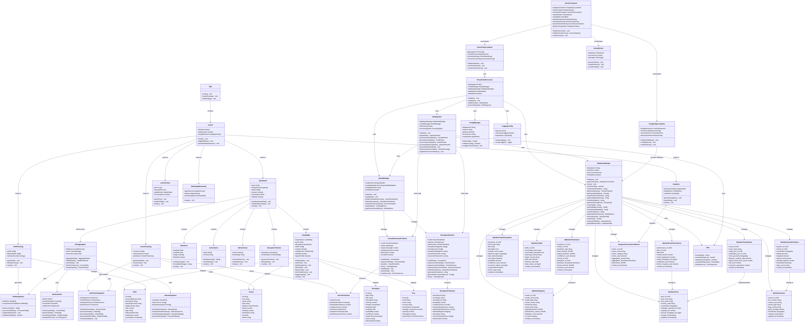

# TradeWatch Complete Architecture - UML Class Diagram

## System Overview
This UML class diagram represents the complete TradeWatch Global Trade Intelligence Platform architecture, including the newly integrated TensorFlow AI processing system and PostgreSQL database infrastructure.

## Architecture Layers

### 1. React Frontend Application
- **Main Application**: App component managing routing and global state
- **Layout System**: Responsive layout with mobile optimization and navigation
- **Page Components**: Dashboard, VesselTracking, TariffTracking, Analytics, LivePortView, MobileAppDownload

### 2. Dashboard Components
- **GlobalMap**: Interactive Leaflet.js map with real-time data visualization
- **DateSlicer**: Temporal data filtering with mobile-responsive design
- **ActiveAlerts**: Real-time disruption and alert management
- **MetricsPanel**: Key performance indicators and system metrics
- **DisruptionTimeline**: Temporal visualization of trade disruptions

### 3. TensorFlow AI Processing System
- **TensorFlowProcessor**: Main FastAPI application for AI processing
- **ModelManager**: Manages multiple AI models and their lifecycle
- **VesselMovementPredictor**: Advanced LSTM+Attention model for vessel prediction
- **DisruptionDetector**: Multi-modal AI for trade disruption detection
- **DataPipeline**: Real-time data ingestion and processing pipeline

### 4. PostgreSQL Database Layer
- **DatabaseManager**: Async PostgreSQL connection and query management
- **Maritime Schema**: Vessels, vessel positions, ports, port performance, disruptions, tariffs, trade routes
- **AI Models Schema**: Model registry, predictions, training sessions, feature store
- **Analytics Schema**: Performance metrics, economic impact, risk assessments
- **Logs Schema**: System events, API requests, data quality logs

### 5. API Integration Layer
- **APIAggregator**: Centralized data aggregation with intelligent caching
- **RealTimeIntegration**: AIS, news, weather, and port data integration
- **TariffIntegration**: Comprehensive tariff data from multiple sources
- **NewsIntegration**: Maritime news analysis and disruption signal extraction
- **MaritimeAPIs**: Core maritime data APIs and services

### 6. Docker Container Infrastructure
- **DockerCompose**: Complete multi-container orchestration
- **PostgreSQLContainer**: PostGIS-enabled database with spatial indexing
- **TensorFlowContainer**: GPU-enabled AI processing with model serving
- **CeleryWorker**: Distributed task processing for background jobs
- **Monitoring Stack**: Prometheus, Grafana, Flower for system monitoring

## Key Features

### AI Processing Capabilities
- **Vessel Movement Prediction**: Uses LSTM networks with attention mechanisms to predict vessel positions and arrival times
- **Disruption Detection**: Multi-modal AI combining news sentiment, vessel anomalies, and economic indicators
- **Economic Impact Assessment**: Real-time calculation of disruption impacts on global trade
- **Continuous Learning**: Models that improve over time with new data

### Database Architecture
- **Geospatial Data**: PostGIS extension for efficient spatial queries and indexing
- **Time-Series Optimization**: Specialized indexing for temporal maritime data
- **AI Model Versioning**: Complete model lifecycle management and performance tracking
- **Real-Time Analytics**: Materialized views and aggregation tables for dashboard performance

### Scalability and Performance
- **Horizontal Scaling**: Docker Compose setup supports multi-instance deployment
- **GPU Acceleration**: TensorFlow models optimized for GPU processing
- **Intelligent Caching**: Multi-layer caching strategy for API responses and predictions
- **Connection Pooling**: Async PostgreSQL connection management for high throughput

### Real-Time Processing
- **Stream Processing**: Continuous data ingestion from multiple maritime APIs
- **Anomaly Detection**: Real-time identification of vessel behavior anomalies
- **Predictive Alerts**: Proactive notification system for potential disruptions
- **Live Updates**: WebSocket-based real-time dashboard updates

## Technology Stack

### Frontend
- **React 18**: Modern component-based UI framework
- **Leaflet.js**: Interactive mapping with mobile optimization
- **Tailwind CSS**: Utility-first styling with responsive design
- **Vite**: Fast development and build tooling

### Backend AI Processing
- **TensorFlow 2.15**: Advanced machine learning and neural networks
- **FastAPI**: High-performance async Python web framework
- **Celery**: Distributed task queue for background processing
- **Redis**: In-memory caching and message broker

### Database
- **PostgreSQL 15**: Robust relational database with ACID compliance
- **PostGIS 3.3**: Geospatial extension for maritime coordinate data
- **AsyncPG**: High-performance async PostgreSQL client

### Infrastructure
- **Docker Compose**: Multi-container application orchestration
- **Prometheus**: Metrics collection and monitoring
- **Grafana**: Visualization and alerting dashboards
- **TensorFlow Serving**: Model deployment and inference serving

### Data Sources
- **AIS Data**: Real-time vessel tracking and positioning
- **Port APIs**: Throughput, congestion, and performance metrics
- **News APIs**: Maritime news and disruption event detection
- **Weather APIs**: Environmental conditions affecting shipping
- **Tariff Databases**: International trade policy and tariff data

## Innovation Highlights

1. **Multi-Modal AI**: First maritime intelligence system combining news sentiment, vessel behavior, and economic indicators for disruption prediction
2. **Attention Mechanisms**: Advanced neural architectures specifically designed for maritime time-series prediction
3. **Real-Time Learning**: Continuous model improvement with live maritime data
4. **Geospatial Intelligence**: Comprehensive spatial analysis of global trade routes and chokepoints
5. **Economic Impact Modeling**: Quantitative assessment of disruption effects on global supply chains

This architecture represents a comprehensive, scalable, and intelligent maritime trade monitoring system capable of processing real-time data, making accurate predictions, and providing actionable insights for global trade stakeholders.
