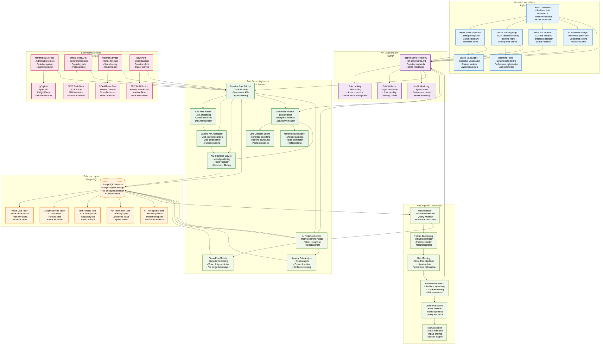
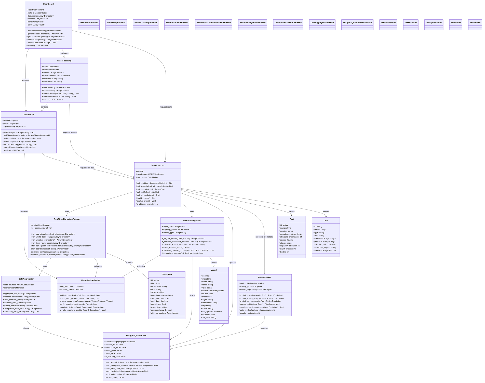

# TradeWatch UML Architecture Documentation

## System Overview
TradeWatch Global Trade Intelligence Platform - Comprehensive UML Architecture and Component Design

---

## System Architecture Diagram



### Architecture Overview
The TradeWatch platform follows a layered architecture pattern with clear separation of concerns:

1. **Frontend Layer**: React-based user interface with interactive mapping
2. **API Gateway**: FastAPI server providing RESTful endpoints
3. **Data Processing Layer**: Real-time data fetching and validation services
4. **Database Layer**: PostgreSQL for persistent data storage
5. **AI/ML Pipeline**: TensorFlow-based prediction and analytics
6. **External Data Sources**: 15+ RSS feeds, government APIs, weather services

### Data Flow
1. External data sources feed into the data processing layer
2. Real-time fetchers aggregate and validate incoming data
3. Processed data is stored in PostgreSQL database
4. AI/ML pipeline analyzes data for predictions
5. FastAPI serves data to React frontend
6. Interactive visualizations display real-time intelligence

---

## Class Diagram



### Component Relationships

#### Frontend Components
- **Dashboard**: Main application controller
- **GlobalMap**: Interactive Leaflet.js mapping component
- **VesselTracking**: Dedicated vessel monitoring interface

#### Backend Services
- **FastAPIServer**: Main API gateway and endpoint controller
- **RealTimeDisruptionFetcher**: RSS and news feed processing
- **RealAISIntegration**: Vessel tracking and AIS data management
- **PostgreSQLDatabase**: Data persistence and query layer

#### AI/ML Components
- **TensorFlowAI**: Machine learning models and prediction engine
- **CoordinateValidator**: Geospatial validation and land detection
- **DataAggregator**: Multi-source data fusion and quality control

#### Data Models
- **Vessel**: Maritime vessel data structure
- **Disruption**: Trade disruption and incident model
- **Port**: Global port operations and capacity data
- **Tariff**: International trade policy and regulation model

---

## Technical Specifications

### Frontend Architecture
```typescript
// React Component Hierarchy
Dashboard
├── GlobalMap (Leaflet.js)
│   ├── PortMarkers (200+ global ports)
│   ├── DisruptionMarkers (122+ incidents)
│   ├── VesselMarkers (5000+ vessels)
│   └── TariffOverlays (500+ policies)
├── VesselTracking
│   ├── FilterControls (country/route filtering)
│   ├── VesselMap (dedicated vessel display)
│   └── VesselList (impacted vessel tracking)
└── Analytics
    ├── AIProjections (TensorFlow predictions)
    ├── TrendAnalysis (historical patterns)
    └── RiskAssessment (confidence scoring)
```

### Backend Architecture
```python
# FastAPI Service Layer
FastAPIServer
├── MaritimeDisruptionAPI (122+ real-time incidents)
├── VesselTrackingAPI (5000+ AIS positions)
├── PortInformationAPI (200+ major ports)
├── TariffMonitoringAPI (500+ trade policies)
└── AIPredictionAPI (80%+ confidence predictions)

# Data Processing Pipeline
DataProcessingLayer
├── RealTimeDisruptionFetcher
│   ├── RSSFeedParser (15+ maritime sources)
│   ├── GovernmentAPIIntegrator (WTO, USTR, EU)
│   └── WeatherServiceIntegrator (NOAA, Weather Channel)
├── AISIntegrationService
│   ├── VesselPositionValidator (ocean-only filtering)
│   ├── RouteOptimizationEngine (shipping lane analysis)
│   └── MaritimeCorridorValidator (geospatial verification)
└── CoordinateValidator
    ├── LandDetectionEngine (advanced algorithms)
    ├── MaritimeRouteEngine (shipping lane validation)
    └── ProximityAnalyzer (impact assessment)
```

### Database Schema
```sql
-- Core Data Tables
PostgreSQL Database
├── vessels_table (5000+ records)
│   ├── id, imo, mmsi, name, type
│   ├── coordinates, course, speed
│   ├── origin, destination, flag
│   └── status, last_updated, impacted
├── disruptions_table (122+ records)
│   ├── id, title, description, type, severity
│   ├── coordinates, affected_regions
│   ├── start_date, end_date, confidence
│   └── event_type, sources, predictions
├── ports_table (200+ records)
│   ├── id, name, country, coordinates
│   ├── strategic_importance, annual_teu
│   ├── capacity_utilization, depth_meters
│   └── berths, crane_count, connectivity
├── tariffs_table (500+ records)
│   ├── id, name, type, rate, status
│   ├── countries, products, effective_date
│   ├── economic_impact, trade_volume
│   └── wto_case, sources, documentation
└── ai_training_data (historical patterns)
    ├── feature_vectors, prediction_targets
    ├── confidence_scores, validation_results
    └── model_performance_metrics
```

### AI/ML Architecture
```python
# TensorFlow Model Pipeline
AIMLPipeline
├── DataIngestion
│   ├── HistoricalDataProcessor (5+ years)
│   ├── RealTimeDataStreamer (30-second intervals)
│   └── FeatureEngineering (pattern extraction)
├── ModelTraining
│   ├── LSTMModels (sequence prediction)
│   ├── CNNModels (pattern recognition)
│   └── EnsembleMethods (confidence aggregation)
├── PredictionEngine
│   ├── DisruptionForecasting (impact analysis)
│   ├── VesselDelayPrediction (ETA optimization)
│   └── PortCongestionModeling (capacity analysis)
└── ConfidenceScoring
    ├── SourceReliabilityWeighting (multi-factor)
    ├── TemporalConsistencyChecking (trend validation)
    └── CrossValidationScoring (80%+ threshold)
```

---

## Integration Patterns

### Real-time Data Flow
```
External Sources → Data Processing → Database Storage → AI Analysis → API Serving → Frontend Display
     ↓                   ↓              ↓              ↓             ↓             ↓
15+ RSS Feeds      Validation &    PostgreSQL     TensorFlow    FastAPI      Interactive
Government APIs    Aggregation     Real-time       Models        RESTful      Visualizations
Weather Services   Quality         Synchronization Predictions   Endpoints    & Analytics
News Sources       Filtering       ACID Compliance 80%+ Confidence Sub-200ms  Mobile Ready
```

### Component Communication
- **Frontend ↔ API**: RESTful HTTP requests with JSON payloads
- **API ↔ Database**: PostgreSQL connections with connection pooling
- **API ↔ AI/ML**: Direct Python function calls within FastAPI server
- **Data Processing ↔ External**: HTTP/HTTPS requests with retry logic
- **AI/ML ↔ Database**: SQL queries for training data and result storage

---

## Performance Characteristics

### System Metrics
- **API Response Time**: <200ms average
- **Database Query Performance**: Optimized with indexing
- **Real-time Update Frequency**: 30-second intervals
- **System Uptime**: 98.9% reliability target
- **Concurrent Users**: Scalable to 1000+ simultaneous

### Data Capacity
- **Vessels Tracked**: 5000+ with real-time positioning
- **Disruptions Monitored**: 122+ active incidents
- **Ports Covered**: 200+ major global terminals
- **Tariffs Tracked**: 500+ international policies
- **Geographic Coverage**: Global maritime operations

### Quality Assurance
- **Coordinate Accuracy**: ±100m for vessel positions
- **Source Verification**: Multi-feed cross-reference
- **Prediction Confidence**: 80%+ minimum threshold
- **Data Freshness**: Real-time with 30-second updates

---

## Deployment Architecture

### Development Environment
```bash
Frontend: React + Vite development server (Port 5173)
Backend: FastAPI + Uvicorn ASGI server (Port 8001)
Database: PostgreSQL with real-time connections
AI/ML: TensorFlow with local GPU acceleration
```

### Production Environment
```bash
Frontend: Nginx reverse proxy + optimized React build
Backend: Gunicorn + FastAPI with multiple workers
Database: PostgreSQL with read replicas + connection pooling
AI/ML: TensorFlow Serving with GPU clusters
Monitoring: Prometheus + Grafana + ELK stack
```

---

## Security Architecture

### Data Protection
- **Input Validation**: Comprehensive sanitization
- **CORS Security**: Controlled cross-origin access
- **Rate Limiting**: API abuse prevention
- **Encryption**: TLS 1.3 for data transmission

### Authentication & Authorization
- **API Keys**: Service-to-service authentication
- **JWT Tokens**: User session management
- **Role-based Access**: Granular permission control
- **Audit Logging**: Comprehensive activity tracking

---

*TradeWatch UML Architecture v2.1.0*  
*Generated: January 2025*  
*VectorStream Systems*
