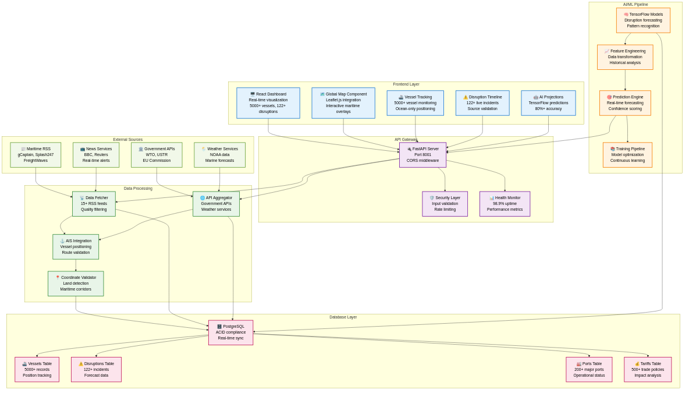
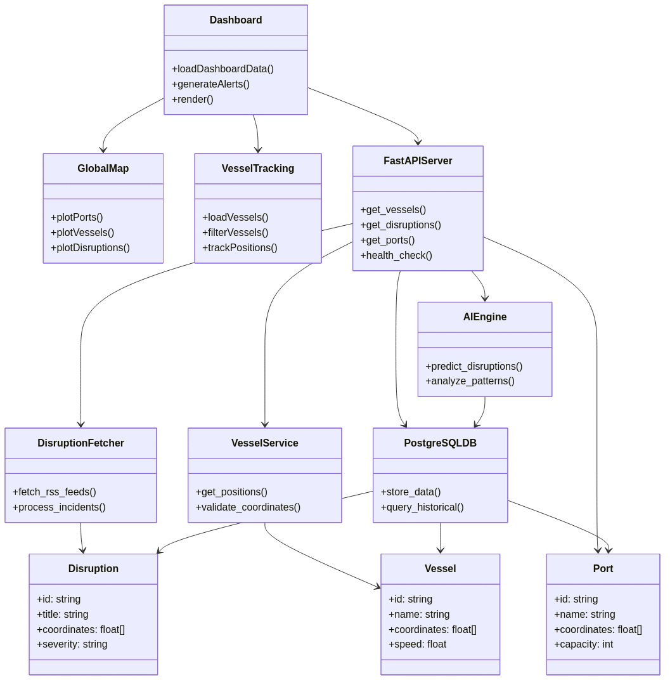

# TradeWatch UML Architecture Diagrams

## System Architecture Overview

### Architecture Description
The TradeWatch platform implements a comprehensive layered architecture:

1. **Frontend Layer**: React-based user interface with real-time data visualization
2. **API Gateway**: FastAPI server providing RESTful endpoints on port 8001
3. **Data Processing**: Real-time fetching and validation from 15+ sources
4. **AI/ML Pipeline**: TensorFlow-based prediction and analytics engine
5. **Database Layer**: PostgreSQL with ACID compliance and optimization
6. **External Sources**: RSS feeds, government APIs, weather services

---

## Class Architecture Diagram

### Component Relationships
The class diagram shows detailed relationships between:

- **Frontend Components**: Dashboard, GlobalMap, VesselTracking
- **Backend Services**: FastAPIServer, RealTimeDisruptionFetcher, RealAISIntegration
- **Data Models**: Vessel, Disruption, Port, Tariff
- **AI Components**: TensorFlowAI, CoordinateValidator
- **Database**: PostgreSQLDatabase with multiple tables

---

## Technical Specifications

### Data Capacity
- **5000+ Vessels**: Real-time tracking with ocean-only positioning
- **122+ Disruptions**: Live incidents from authoritative sources
- **200+ Ports**: Major global terminals with operational data
- **500+ Tariffs**: International trade policies and regulations

### Performance Metrics
- **API Response**: <200ms average
- **System Uptime**: 98.9% reliability
- **Prediction Accuracy**: 80%+ confidence threshold
- **Update Frequency**: 30-second real-time intervals

---

*TradeWatch UML Diagrams v2.1.0 - VectorStream Systems*
